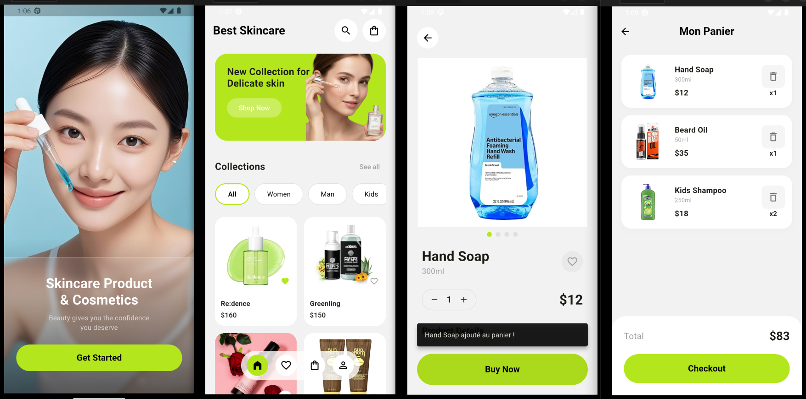

# 🌿 Skincare App - Boutique Cosmétique Moderne (Flutter)

**Skincare App** est une application mobile élégante et intuitive dédiée à la vente de produits de soin de la peau. Ce projet met en avant une expérience utilisateur (UX) fluide, des animations soignées et une gestion d'état maîtrisée, illustrant parfaitement la puissance de **Flutter** pour le e-commerce.

---

## 🔥 Fonctionnalités Maîtresses

*   **🎨 Design Épuré** : Une interface minimaliste et apaisante, alignée sur l'univers du soin et du bien-être.
*   **⚡ Navigation Fluide** : Utilisation intensive du widget `Hero` pour des transitions d'images spectaculaires entre la boutique et les détails du produit.
*   **🛒 Shopping Interactif** : Système de panier dynamique avec calcul en temps réel et confirmations visuelles (SnackBars).
*   **❤️ Liste de Souhaits** : Gestion intuitive des favoris pour une personnalisation de l'expérience utilisateur.

---

## 📸 Aperçu Visuel



---

## 🛠️ Architecture & Structure du Code

Le projet est organisé de manière modulaire en respectant la structure **[.dart](cci:7://file:///home/bellox/Documents/Stage/bellox1%20%28copie%29/Projets/X0/bin/main.dart:0:0-0:0)** pour garantir une maintenance aisée.

### 1. 📂 Core Logic (`lib/`)
*   **[main.dart](cci:7://file:///home/bellox/Documents/Stage/bellox1%20%28copie%29/Projets/X0/bin/main.dart:0:0-0:0)** : Point d'entrée orchestrant les routes et le thème global de l'application.
*   **`lancement.dart`** : Splash screen immersif avec appel à l'action.
*   **`boutique.dart`** : Hub principal avec filtrage dynamique (Women, Men, Kids) et grille de produits.
*   **`detail.dart`** : Fiche produit détaillée avec gestion des quantités et animations Hero.
*   **`panier.dart`** : Gestion des articles, calcul des totaux et processus de checkout simulé.
*   **`favoris.dart` & `profil.dart`** : Espaces personnalisés pour l'utilisateur.

### 2. 🏗️ Modèle de Données (`lib/modeles/`)
*   **`produit.dart`** : Définition de la classe `Produit` (attributs, prix, catégories).
*   **`donnees_fictives.dart`** : Mock data permettant de tester l'UI sans base de données externe.

### 3. 🧠 Services & State (`lib/services/`)
*   **`service_panier.dart`** : Logique métier (ajouter, supprimer, vider, total).
*   **`service_favoris.dart`** : Gestion centralisée des coups de cœur.

---

## 🚀 Installation & Lancement

### 1. Prérequis
*   **Flutter SDK** (v3.0.0 ou supérieure)
*   Un émulateur (Android/iOS) ou un navigateur (Chrome) pour le test.

### 2. Installation des dépendances
Utilisez la commande Flutter standard pour récupérer les packages :
```bash
flutter pub get
# Commande standard (équivalent de npm start)
flutter run

# Pour forcer le lancement sur Chrome (Web)
flutter run -d chrome


